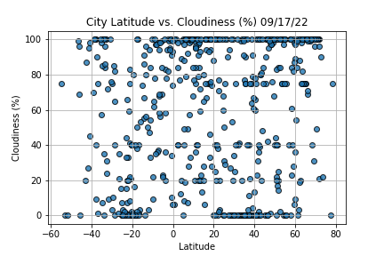

# World_Weather_Analysis

We had collected, analyzed, and displayed weather data of cities across the world to recommend the preferred vacation stays depending on the clients' weather preferences. Images of the weather data, as well as an example itinerary has been included.

We generated a set of 2,000 random latitudes and longitudes, retrieved the nearest cities, and performed an API call with OpenWeatherMap. In addition to the city weather data we gathered in the WeatherPy notebook, we used our API skills to retrieve the current weather description for each city. Then, created a new DataFrame containing the updated weather data.

Here are a few plots showing some relationships that would be pertinent to the weather of any particular city:

City Latitude vs. Max Temperature(F):

City Latitude vs. Humidity(%):

City Latitude vs. Cloudiness(%):

City Latitude vs. Wind Speed(mph):

We then employed input statements to retrieve customer weather preferences. Next, we used those preferences to identify potential travel destinations and nearby hotels. Finally, we showed those destinations on a marker layer map with pop-up markers.

We used the Google Directions API to create a travel itinerary that shows the route between four cities chosen from the customer’s possible travel destinations. Then, we created a marker layer map with a pop-up marker for each city on the itinerary.

Below is a sample map of an itinerary that was generated:

Tools/Resources:
Python, Pandas, NumPy, Google APIs.
